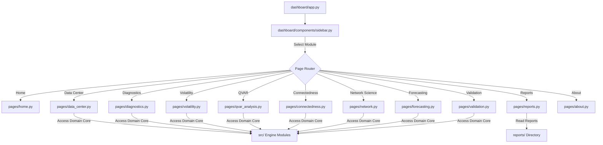

# Q-RiskNet India — Dashboard Architecture & User Experience Guide

**Author**: Bibek Rout  
**Version**: 1.0.0 (Phase 10 Release)  
**License**: MIT License  

---

## 🏗️ Overview

The **Q-RiskNet India** user interface is designed as an enterprise quantitative finance platform built exclusively with **Streamlit** (Python). The frontend contains zero external JavaScript frameworks, maintaining strict compliance with research software engineering guidelines.

The architecture emphasizes:
1. **Modularity**: Every dashboard view is isolated inside a cohesive page module in `dashboard/pages/`.
2. **Reusability**: Shared UI elements (KPI cards, charts, data tables, status badges, export buttons) are organized in `dashboard/components/`.
3. **Performance & Caching**: Heavy econometric routines (GARCH fitting, QVAR estimation, unit root diagnostics) are wrapped with `@st.cache_data` and execution timers.
4. **Resilience**: Input checks, date range validation, and graceful exception handling prevent application crashes.

---

## 📁 Directory & Component Hierarchy

```text
dashboard/
├── app.py                      # Master entry point, routing & data orchestration
├── pages/                      # Modular Page Controllers
│   ├── home.py                 # Landing page, executive summary & research questions
│   ├── data_center.py          # Ingestion, validation, prices, returns & drawdowns
│   ├── diagnostics.py          # Stationarity, autocorrelation, ARCH-LM & KDE
│   ├── volatility.py           # ARCH/GARCH/EGARCH/GJR-GARCH comparative models
│   ├── qvar_analysis.py        # QVAR estimation, heatmaps, quantile stability & GIRF
│   ├── connectedness.py        # Diebold-Yilmaz spillover matrix & dynamic rolling TCI
│   ├── network.py              # Directed spillover graph, centrality & MST
│   ├── forecasting.py          # Baseline, ML & Quantile LSTM forecasting benchmarks
│   ├── validation.py           # Robustness & sensitivity analysis (W, H, τ_edge)
│   ├── reports.py              # Centralized report catalog & export center
│   └── about.py                # Platform methodology, tech stack & author info
├── components/                 # Reusable Presentation Components
│   ├── sidebar.py              # Research navigation & global parameters
│   ├── kpi_cards.py            # Executive KPI metrics (TCI, Net Transmitter/Receiver)
│   ├── charts.py               # Plotly network, spillover, KDE & forecast charts
│   ├── tables.py               # Styled Pandas DataFrames & spillover matrices
│   ├── exports.py              # CSV, JSON & HTML chart export handlers
│   └── status.py               # Safe execution wrappers & status badges
└── utils/                      # UI Styling & Layout Configuration
    └── theme.py                # Executive dark theme CSS & title banners
```

---

## 🗺️ Module Workflow & Navigation



---

## ⚡ Performance & Caching Strategy

| Operation | Cache Decorator | Purpose |
|:---|:---|:---|
| Data Engineering Pipeline | `@st.cache_data` | Prevents redundant Yahoo Finance API calls & return calculations |
| Econometric Diagnostics | `@st.cache_data` | Caches ADF, KPSS, ZA, ARCH-LM & BDS test results |
| Volatility Models | `@st.cache_data` | Caches ARCH, GARCH, EGARCH, GJR-GARCH estimations |
| QVAR Diagnostics | `@st.cache_data` | Caches 7-quantile regression fits and summary tables |
| GARCH Volatility Proxy | `@st.cache_data` | Eliminates per-rerun GARCH volatility proxy re-computation |

---

## 📥 Export & Research Accessibility

Every page includes explicit export utilities:
- **CSV Data Download**: All summary tables, diagnostics, centrality measures, and forecasts can be exported directly via `download_csv()`.
- **JSON Metadata**: Structured JSON reports (`forecast_benchmark_report.json`, `research_validation_report.json`) are accessible in the Reports Center (`pages/reports.py`).
- **Reports Center**: Consolidates 11+ output artifacts into a searchable download hub.

---

## 🛡️ Error Handling & Defensive Design

1. **Date Validation**: Ensures `start_date < end_date` in `sidebar.py`.
2. **Sector Count Guard**: Requires at least 2 sectoral indices before triggering network/spillover routines.
3. **Safe Execution Wrappers**: Functions in `components/status.py` catch runtime exceptions gracefully without terminating the application.
