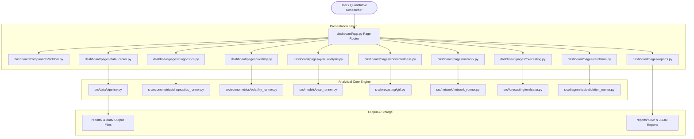

# Q-RiskNet India — System Architecture & Design Specification

**Author**: Bibek Rout  
**Version**: 1.0.0  
**License**: MIT License  

---

## 🏛️ Executive System Overview

**Q-RiskNet India** is structured as an enterprise quantitative finance and financial econometrics research platform. The system is split into two primary layers:

1. **Domain Logic Layer (`src/`)**: Decoupled, modular Python modules handling data ingestion, econometric diagnostics, volatility estimation, multi-quantile VAR regression, Diebold-Yilmaz spillover metrics, graph-theoretic network science, and machine/deep learning forecasting.
2. **Presentation Layer (`dashboard/`)**: A pure Streamlit application composed of 11 isolated page controllers in `dashboard/pages/` and reusable presentation components in `dashboard/components/`.

---

## 🔄 Module Interaction & Data Pipeline Flow

### 1. Data Ingestion & Preprocessing (`src/data/`)
- **Download**: `fetch_raw_market_data()` downloads sectoral indices from Yahoo Finance.
- **Validation**: `validate_dataset()` checks row count, missing value percentage, and extreme price gaps.
- **Feature Generation**: `compute_comprehensive_features()` calculates percentage log returns $r_{i,t} = 100 \times \ln(P_{i,t} / P_{i,t-1})$, historical peak-to-trough drawdowns, and rolling 20-day annualized volatility.

### 2. Econometric Diagnostics (`src/econometrics/`)
- **Stationarity**: Augmented Dickey-Fuller (ADF), KPSS, and Zivot-Andrews structural break unit root tests.
- **Autocorrelation**: Ljung-Box test and sample ACF/PACF computation.
- **Heteroskedasticity**: Engle's ARCH-LM test and rolling 20-day sample variance.
- **Fat-Tail Distribution**: Jarque-Bera normality test and Gaussian vs. Empirical KDE density overlays.
- **Non-Linearity & Breaks**: BDS test for independence and OLS CUSUM stability tests.

### 3. Volatility Estimation (`src/econometrics/volatility.py`)
- Evaluates four GARCH family specifications using `arch_model`:
  1. $\text{ARCH}(1)$
  2. $\text{GARCH}(1,1)$ (Symmetric)
  3. $\text{EGARCH}(1,1,1)$ (Nelson's Exponential)
  4. $\text{GJR-GARCH}(1,1,1)$ (Glosten-Jagannathan-Runkle Asymmetric Threshold)
- Computes persistence $P = \alpha + \beta + 0.5\gamma$, shock half-life $\text{HL} = \ln(0.5)/\ln(P)$, and multi-step forecasts ($t+1, t+5, t+20$).

### 4. Quantile VAR Modeling (`src/models/qvar.py`)
- Fits $K$-equation Quantile Regression across quantiles $\tau \in \{0.05, 0.10, 0.25, 0.50, 0.75, 0.90, 0.95\}$:
  $$\mathbf{Q}_\tau(\mathbf{r}_t \mid \mathbf{r}_{t-1}) = \mathbf{c}(\tau) + \sum_{l=1}^p \boldsymbol{\Phi}_l(\tau) \mathbf{r}_{t-l}$$
- Generates coefficient matrices $\boldsymbol{\Phi}_1(\tau)$ and GIRF impulse response curves.

### 5. Spillover & Connectedness Engine (`src/forecasting/girf.py`)
- Computes Generalized Impulse Response Simulation (GIRF) under $+2\sigma$ sectoral shocks across forecast horizon $H=10$.
- Normalizes variance decomposition to construct the $K \times K$ Diebold-Yilmaz Spillover Matrix $\mathbf{S}^H(\tau)$.
- Computes Gross Outgoing ($\text{TO}_i$), Gross Incoming ($\text{FROM}_i$), Net Directional ($\text{NET}_i = \text{TO}_i - \text{FROM}_i$), and Total Connectedness Index ($\text{TCI}$).

### 6. Financial Network Topology (`src/network/`)
- **Centrality**: Converts spillover matrix to directed NetworkX graph `DiGraph`. Computes Out-Degree, In-Degree, Betweenness, Closeness, PageRank, and Eigenvector centralities.
- **Community Detection**: Eigengap Spectral Clustering on normalized affinity matrices.
- **Minimum Spanning Tree (MST)**: Converts correlation matrix to distance metric $d_{i,j} = \sqrt{2(1 - \rho_{i,j})}$ and extracts MST using Kruskal's algorithm.

### 7. Forecasting Benchmark (`src/forecasting/evaluator.py`)
- Fits 7 out-of-sample models: Naive Random Walk, Historical Mean, ARIMA(1,0,1), Random Forest, Gradient Boosting, SVR, and PyTorch Quantile LSTM.
- Evaluates RMSE, MAE, Directional Accuracy %, and Diebold-Mariano test statistics.

---

## ⚙️ Configuration Management

Central settings are defined in [`configs/config.yaml`](file:///c:/Users/BIBEK/OneDrive/Desktop/Indian_Stock_Market_Analysis/configs/config.yaml) and exported via [`src/config/settings.py`](file:///c:/Users/BIBEK/OneDrive/Desktop/Indian_Stock_Market_Analysis/src/config/settings.py). All file paths are strictly relative to the repository root directory.
